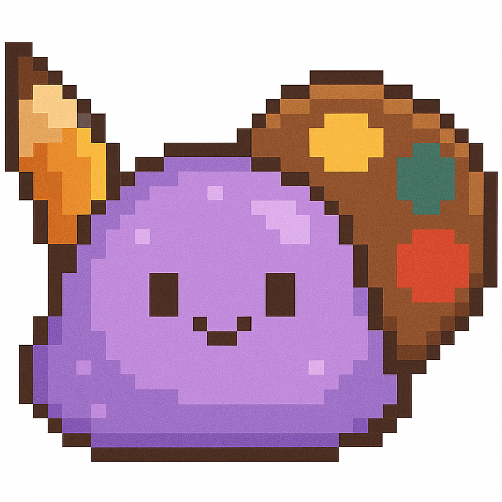

<div align="center">

<p align="center">
    
</p>

# 🧁 Gumdrop Studio

**A delightful browser-based pixel art creation app**

[](https://reactjs.org/)
[](https://vitejs.dev/)
[](https://tailwindcss.com/)
[](LICENSE)

*Create adorable pixel art with a unique dual-layer canvas system!*

[Features](#-features) • [Getting Started](#-getting-started) • [Usage](#-usage) • [Export](#-export-options) • [Tech Stack](#%EF%B8%8F-tech-stack)

</div>

---

## ✨ Features

### 🎨 Dual-Layer Canvas System
The **best feature** of Gumdrop Studio! Draw blocky pixel art on one layer, then add fine details like whiskers, smiles, or highlights on a smooth vector overlay layer.

- **Pixel Layer**: Crisp, blocky RGBA pixel array (perfect for sprites)
- **Overlay Layer**: Anti-aliased vector paths for thin accent lines (1-6px)

### 🛠️ Drawing Tools

| Tool | Description |
|------|-------------|
| ⬛ **Pixel Stamp** | Place a single pixel with live preview (default) |
| 🖊️ **Pencil** | Freehand pixel drawing |
| 🧽 **Eraser** | Remove pixels |
| 📏 **Line** | Straight lines with Bresenham algorithm |
| ▭ **Rectangle** | Outline or filled boxes |
| ◯ **Circle** | Perfect circles with midpoint algorithm |
| ☾ **Curve** | Smooth quadratic Bezier curves (3-click) |
| ✨ **Accent Pen** | Thin vector lines for fine details |
| 🎯 **Eyedropper** | Pick colors from canvas |

### 🌈 Advanced Color System

- **HSV Color Wheel**: Circular picker for intuitive color selection
- **Alpha Channel**: Full transparency support (0.0–1.0)
- **Hex Input**: Direct color code entry
- **Color Persistence**: Colors maintained across sessions

### 🔧 Canvas Features

- **Adjustable Zoom**: 4x to 40x magnification (default 16x)
- **Grid Overlay**: Toggle-able pixel grid for precise alignment
- **Flexible Sizes**: Create canvases from 4×4 to 256×256 pixels
- **Theme-Aware Grid**: Grid lines automatically adjust for visibility in light and dark mode
- **Softer Light Theme**: Warm cream gradient replaces bright white to reduce glare
- **Undo/Redo**: Full history management with unlimited steps

### 💾 Project Management

- **Save/Load**: Projects stored in browser localStorage
- **Auto-Save**: Automatic persistence with project list
- **Quick Actions**: New project, duplicate, delete

---

## 🚀 Getting Started

### Prerequisites

- **Node.js** 18+ 
- **npm** or **yarn**

### Installation

```bash
# Clone the repository (or download)
git clone <your-repo-url>
cd gumdrop-studio

# Install dependencies
npm install
```

### Development

```bash
npm run dev
```

🎉 Opens automatically at **http://localhost:1234**

### Build for Production

```bash
npm run build
```

Outputs optimized bundle to `dist/` directory.

### Preview Production Build

```bash
npm run preview
```

---

## 🎯 Usage

1. **Select a tool** from the left panel (Pixel Stamp is selected by default, switch to Pencil, Line, Circle, etc. as needed)
2. **Choose a color** using the color wheel or hex input
3. **Draw on the canvas** with mouse or touch
4. **Use Accent Pen** for fine details like whiskers or highlights
5. **Undo/Redo** as needed with history buttons
6. **Save your project** with the Save button
7. **Export** in your preferred format when done!

### 🎨 Pro Tips

- **Curve Tool**: Click 3 times (start → control point → end)
- **Fill Toggle**: Enable for filled rectangles
- **Grid Overlay**: Helpful for precise pixel placement
- **Accent Pen**: Use 1-2px width for whiskers, 3-4px for thicker accents
- **Zoom**: Increase for fine detail work, decrease for overview

---

## 📤 Export Options

| Format | Description | Use Case |
|--------|-------------|----------|
| **PNG** 🖼️ | Transparent or opaque background | Web graphics, game sprites |
| **JPG** 📷 | Opaque background, smaller file size | Backgrounds, photos |
| **SVG** 🎨 | Vector format (scalable) | Logos, scalable graphics |
| **JSON** 📦 | Complete state data | Backup, sharing, re-editing |
| **HTML** 🌐 | Self-contained renderer | Embeddable demos, portfolios |

---

## 🏗️ Project Structure

```
gumdrop-studio/
├── public/
│   ├── index.html          # HTML entry
│   └── favicon.png         # 🧁 Favicon
├── src/
│   ├── assets/
│   │   ├── icon.png        # App icon
│   │   └── logo.png        # Brand logo
│   ├── components/
│   │   ├── Canvas.jsx      # Dual-canvas rendering
│   │   ├── ColorWheel.jsx  # HSV color picker
│   │   ├── ProjectPanel.jsx # Save/load/export UI
│   │   └── ToolPanel.jsx   # Tool selection + controls
│   ├── utils/
│   │   ├── canvas.js       # Canvas rendering helpers
│   │   ├── colors.js       # Color conversions
│   │   ├── helpers.js      # Generic utilities
│   │   └── rasterizers.js  # Shape algorithms
│   ├── App.jsx             # Main app logic
│   ├── index.css           # Global styles
│   └── main.jsx            # React entry
├── OVERVIEW.md             # Comprehensive docs
├── WARP.md                 # Dev guidance
├── LICENSE                 # Apache 2.0
└── package.json
```

---

## 🛠️ Tech Stack

- **React 19.2.0** - Modern UI framework with latest features
- **Vite 7.1.12** - Lightning-fast build tool and dev server
- **Tailwind CSS 4.1.16** - Utility-first styling with latest improvements
- **Canvas API** - Native HTML5 rendering (pixel-perfect + anti-aliased)

*All dependencies are **latest stable versions** as of October 2025.*

---

## 📚 Documentation

- **[OVERVIEW.md](OVERVIEW.md)** - Comprehensive technical documentation
- **[WARP.md](WARP.md)** - Development guidance for Warp users
- **README.md** (this file) - Quick start guide

---

## 🤝 Contributing

Contributions are welcome! Feel free to:

- 🐛 Report bugs
- 💡 Suggest features
- 🔧 Submit pull requests
- 📖 Improve documentation

Please ensure code follows existing patterns and conventions.

---

## 📄 License

**Apache License 2.0** - See [LICENSE](LICENSE) for details.

Copyright © 2025 Pink Pixel

---

## 💗 Credits

**Created by [Pink Pixel](https://pinkpixel.dev)**

- 🌐 Website: [pinkpixel.dev](https://pinkpixel.dev)
- 💻 GitHub: [@pinkpixel-dev](https://github.com/pinkpixel-dev)
- ☕ Support: [Buy me a coffee](https://www.buymeacoffee.com/pinkpixel)
- 📧 Contact: admin@pinkpixel.dev

---

<div align="center">

### ✨ Dream it, Pixel it ✨

*Made with 💗 by Pink Pixel*

**Now go draw some pixelated kittens!** 🐱

</div>
